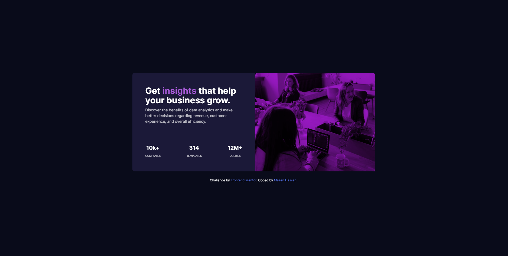

# Frontend Mentor - Stats preview card component solution

This is a solution to the [Stats preview card component challenge on Frontend Mentor](https://www.frontendmentor.io/challenges/stats-preview-card-component-8JqbgoU62). Frontend Mentor challenges help you improve your coding skills by building realistic projects. 

## Table of contents
- [Frontend Mentor - Stats preview card component solution](#frontend-mentor---stats-preview-card-component-solution)
  - [Table of contents](#table-of-contents)
    - [The challenge](#the-challenge)
    - [Screenshot](#screenshot)
    - [Links](#links)
    - [Built with](#built-with)
    - [What I learned](#what-i-learned)
    - [Continued development](#continued-development)
    - [Useful resources](#useful-resources)

### The challenge

Users should be able to:

- View the optimal layout depending on their device's screen size

### Screenshot

### Links

- Solution URL: [Add solution URL here](https://www.frontendmentor.io/solutions/stats-preview-card-using-sass-Xz9-7bCFQt)
- Live Site URL: [Add live site URL here](https://stats-preview-card-xi-nine.vercel.app/)

### Built with

- Semantic HTML5 markup
- CSS custom properties
- Flexbox
- CSS Grid
- Mobile-first workflow
- [Styled Components](https://sass-lang.com/) - For styles

### What I learned

I learned that sometimes using the gap property to create spacing is more reliable and better than manual margins.

### Continued development

I want to maintain consistency and be quicker at coding, designing, and solving problems more effectively.

### Useful resources

- [mix-blend-mode](https://developer.mozilla.org/en-US/docs/Web/CSS/mix-blend-mode) - This MDN was useful in showing how to use blending options and how syntax works.
